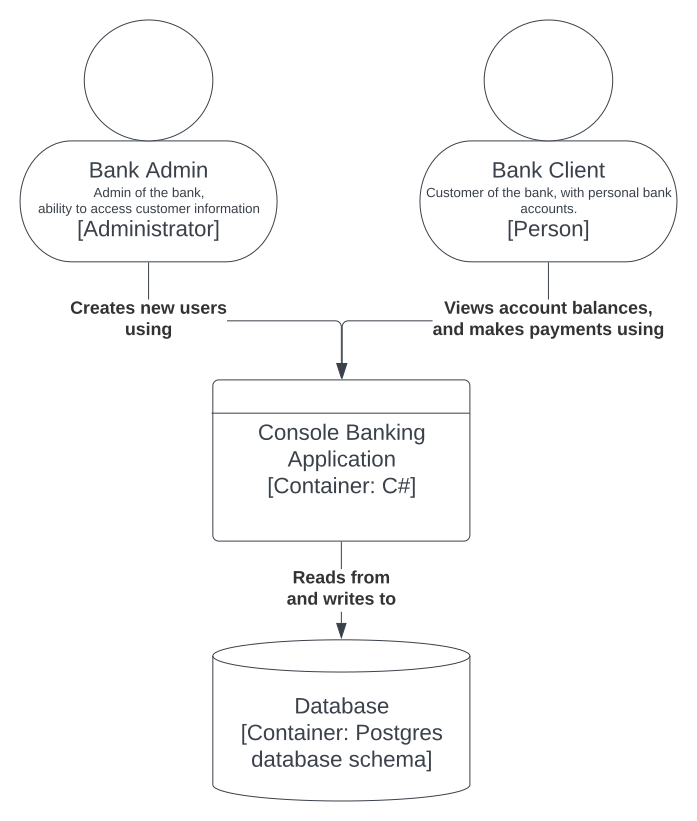

    

<h1 align="center"> Team OWL Bank Project</h1>

<h2 align = center> Team members</h2>

  <a href="https://github.com/lordstimpa">Steven</a>&nbsp;&nbsp;&nbsp;&nbsp;|&nbsp;&nbsp;&nbsp;&nbsp;<a href="https://github.com/generalxo">Oliver</a>&nbsp;&nbsp;&nbsp;&nbsp;|&nbsp;&nbsp;&nbsp;&nbsp;<a href="https://github.com/Cecilia-Coutinho">Cecilia</a>&nbsp;&nbsp;&nbsp;&nbsp;|&nbsp;&nbsp;&nbsp;&nbsp;<a href="https://github.com/ChasAcademy-Nshoan-Abdlwafa">Nshoan</a>

-- Click on any name to access our individual GitHub profiles --

# 🌍 Overview

Bank application developed using C# programming language with .NET 6.0. The application was built to provide banking services such as account management, funds transfer, transaction history, etc and the user interface was designed to be intuitive and user-friendly. It was also designed to connect with the PostgreSQL database to retrieve and store data such as customer information, account details, and transaction data.

The project was managed within the Scrum framework which involved iterative development cycles, daily stand-up meetings, and regular sprint plannings and retrospectives to improve the product continuously. Throughout the development process, the team conducted regular testing and quality assurance to ensure the application was reliable and free of bugs.

# 🔨 Tools
* IDE: Visual Studio
* Languages: C#, SQL
* Frameworks: .Net, Dapper, Npgsql
* RDBMS: PostgreSQL
* DBMS: DbGate

# 💻 Structure

Our Bank console application is built upon having a connection to a database which enables us to access the data of the users registered to our application.

The general structure of our program is illustrated with a C4 model design (UML) which can be seen below. The C4 model considers the static structure of the program. A static structure is

- For more information about the C4 model visit: https://c4model.com/

A system context diagram (level 1 scope) was not necessary to create. Mainly because our console application does not rely any other resources except the PostgreSQL database.

## Container diagram (Level 2 scope)

What can be seen from the diagram below is that the application consists of two primary types of users, a bank administrator and bank client. They are both using the console application which it turn connects to a database.

<picture>
  
</picture>

## Component diagram (Level 3 scope)

The Bank consists of three major components which are:

- Sign-in controller
- Account information provider
- Money transfer handler

<picture>
  
</picture>

## Code Structure

During the process of developing the bank application all of us had a goal of keeping the code rather structured and clean. Which improves the ability to debug, resolve errors and keep track of our code.

The entire program consists of 7 files which are:

- Program.cs
- SQLconnection.cs
- UserModel.cs
- BankAccountModel.cs
- TransactionsModel.cs
- CurrencyConverter.cs
- App.config (which is not included in the repository for safety reasons)

Program.cs consists of methods such as a function that displays a menu used to navigate within the bank. Also calculations, and functions such as transfer, deposit and withdraw money.
All the SQL queries and connections to the PostgreSQL database are located in the file named SQLconnection.cs

### Deposit method

The code used to give users the possibility to easily convert a currency during a transaction is located in the CurrencyConverter.cs file.

All of the classes used are UserModel.cs, BankAccountModel.cs and TransactionsModel.cs.

# 📏 Methodologies

Our work method were initially quite simple at first as this was our first group project as well as the first time we used any agile methodologies so we were uncertain on what to do. So after our first discussion as a group we began doing research to make the planning easier. Our teacher also recommended us to use Trello for planning purposes beforehand so we took their advice and saved ourselves some time.

- Our Trello Board: https://trello.com/b/rIxvs4Fi/grupp-project

We then had to decide on what agile methodology to use. After some more research the choice fell between Kanban and Scrum. We went with Kanban at first but switched to a more Scrum-like approach later on as this allowed us to work in weekly sprints in a way that fit the group's needs. Our agile approach could be described as a hybrid of both Kanban and Scrum but mostly the latter.

With the planning tool and agile methodology set in stone we could now jump into the coding. We held daily meetings where we discussed on what we were gonna do for the day and then proceeded to code together. We did this during the first week so that everyone could get a solid grasp on what was being coded. This did make the group feel more confident in each other as well.

We also agreed to always speak to each other before pushing any code in order to avoid any mishaps which could potentially cost us lots of time. Our GitHub repo did also have branch protection enabled on the main branch which meant that any pull requests made by a member had to be read and approved by other members before the pull request could finally be closed, pushing the new code into the main branch.

We decided a week later to start assigning individual tasks to each member as the foundation of the code had been laid at this point. We also agreed to have a meeting every week where we would discuss the current status of the project and start the next sprint at the same time. We did otherwise communicate with each other on both Discord and Slack outside of the weekly meetings.

The weekly meetings later evolved to include a retrospective as well after feedback from our team coach. This streamlined our planning further as each member could now give feedback on what they felt was done well during the last sprint and what could be done differently during the next sprint.

# 📝 Reflections

### Week 1

During the first week of the group project we were uncertain about how to approach the project.
Communication was a factor to our uncertainty which we had to plan out.
Week 1 was not so much about the work, rather more about planning and to structure the way we work.
A part of the time we had we used to research about agile methodologies and the manifesto.
We were also getting to know eachother which was not a written step, but something rather important.
During the first week and a bit into the next, we were working together at all times. Which improved
our communication and trust in eachothers work.

### Week 2

During week 2 we had established a good foundation to upon. At this point we started to work individually
with our individual task. We decided that we are going to plan a sprint during a meeting once a week.
This worked great and put us all on the right path of our development of the Bank application.

### Week 3

Once week 3 started we had a meeting with our team coach where we established a new approach to improve our day of planning.
An analasys of the previous sprint (week) was to be had during our weekly meeting. During this analasys we bring up the things that could be improved upon and what was working great.

### Week 4

Week 4 we continued with working the way had the previous week since it didn't need to be adjusted to any other way.
We prioriticed on polishing and creating consistency in our code and application.
Now that we are close to ending our project we all agree that the time we had together had gone by very fast and was a very informative experience.

Unfortunately due to certain tasks getting a bigger priority a functionality which was to provide a user to take a loan from the bank did not fit into the schedule which is why the functionality is not included.
Our top priority is to finish the most important parts which are required to fully complete our project.

# 📌Misc

### Links

- Scrum Board (Trello): https://trello.com/b/rIxvs4Fi/grupp-project
- C4 Diagram (UML): https://c4model.com/
